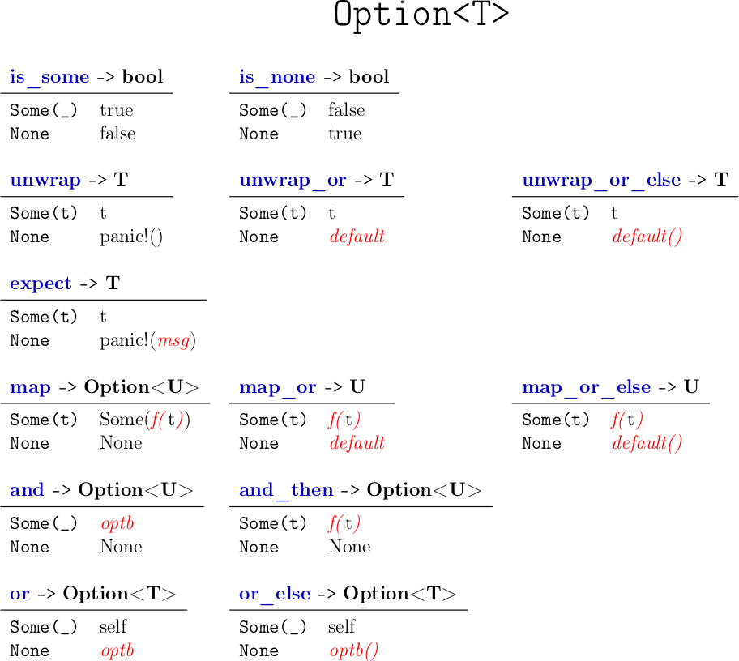
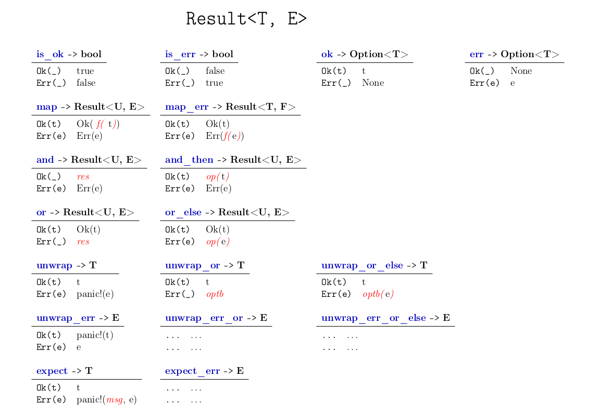

# `Option<T>`

---

# `Result<T, E>`

# Markup

<table>
  <tr>
    <th colspan="2"><code>is_some() -&gt; bool</code></th>
    <th></th>
    <th colspan="2"><code>is_none() -&gt; bool</code></th>
    <th></th>
    <th colspan="2"></th>
  </tr>
  <tr>
    <td><pre class="rust precode">Some(_)</pre></td>
    <td><pre class="rust precode">Some(_)</pre></td>
    <td></td>
    <td><pre class="rust precode">Some(_)</pre></td>
    <td><pre class="rust precode">false</pre></td>
    <td></td>
    <td><pre class="rust precode"></pre></td>
    <td><pre class="rust precode"></pre></td>
  </tr>
  <tr>
    <td><pre class="rust precode">None</pre></td>
    <td><pre class="rust precode">false</pre></td>
    <td></td>
    <td><pre class="rust precode">None</pre></td>
    <td><pre class="rust precode">true</pre></td>
    <td></td>
    <td><pre class="rust precode"></pre></td>
    <td><pre class="rust precode"></pre></td>
  </tr>
  <tr>
    <td></td>
    <td></td>
    <td></td>
    <td></td>
    <td></td>
    <td></td>
    <td></td>
    <td></td>
  </tr>
  <tr>
    <th colspan="2"><code>unwrap() -&gt; T</code></th>
    <th></th>
    <th colspan="2"><code>unwrap_or(def) -&gt; T</code></th>
    <th></th>
    <th colspan="2"><code>unwrap_or_else(f) -&gt; T</code></th>
  </tr>
  <tr>
    <td><pre class="rust precode">Some(t)</pre></td>
    <td><pre class="rust precode">t</pre></td>
    <td></td>
    <td><pre class="rust precode">Some(t)</pre></td>
    <td><pre class="rust precode">t</pre></td>
    <td></td>
    <td><pre class="rust precode">Some(t)</pre></td>
    <td><pre class="rust precode">t</pre></td>
  </tr>
  <tr>
    <td><pre class="rust precode">None</pre></td>
    <td><pre class="rust precode">panic!()</pre></td>
    <td></td>
    <td><pre class="rust precode">None</pre></td>
    <td><pre class="rust precode">def</pre></td>
    <td></td>
    <td><pre class="rust precode">None</pre></td>
    <td><pre class="rust precode">f()</pre></td>
  </tr>
  <tr>
    <td></td>
    <td></td>
    <td></td>
    <td></td>
    <td></td>
    <td></td>
    <td></td>
    <td></td>
  </tr>
  <tr>
    <th colspan="2"><code>expect(msg) -&gt; T</code></th>
    <th></th>
    <th colspan="2"></th>
    <th></th>
    <th colspan="2"></th>
  </tr>
  <tr>
    <td><pre class="rust precode">Some(t)</pre></td>
    <td><pre class="rust precode">t</pre></td>
    <td></td>
    <td><pre class="rust precode"></pre></td>
    <td><pre class="rust precode"></pre></td>
    <td></td>
    <td><pre class="rust precode"></pre></td>
    <td><pre class="rust precode"></pre></td>
  </tr>
  <tr>
    <td><pre class="rust precode">None</pre></td>
    <td><pre class="rust precode">panic!(msg)</pre></td>
    <td></td>
    <td><pre class="rust precode"></pre></td>
    <td><pre class="rust precode"></pre></td>
    <td></td>
    <td><pre class="rust precode"></pre></td>
    <td><pre class="rust precode"></pre></td>
  </tr>
  <tr>
    <td></td>
    <td></td>
    <td></td>
    <td></td>
    <td></td>
    <td></td>
    <td></td>
    <td></td>
  </tr>
  <tr>
    <th colspan="2"><code>map(f) -&gt; Option&lt;U&gt;</code></th>
    <th></th>
    <th colspan="2"><code>map_or(default, f) -&gt; U</code></th>
    <th></th>
    <th colspan="2"><code>map_or_else(default, f) -&gt; U</code></th>
  </tr>
  <tr>
    <td><pre class="rust precode">Some(t)</pre></td>
    <td><pre class="rust precode">Some(f(t))</pre></td>
    <td></td>
    <td><pre class="rust precode">Some(t)</pre></td>
    <td><pre class="rust precode">f(t)</pre></td>
    <td></td>
    <td><pre class="rust precode">Some(t)</pre></td>
    <td><pre class="rust precode">f(t)</pre></td>
  </tr>
  <tr>
    <td><pre class="rust precode">None</pre></td>
    <td><pre class="rust precode">None</pre></td>
    <td></td>
    <td><pre class="rust precode">None</pre></td>
    <td><pre class="rust precode">default</pre></td>
    <td></td>
    <td><pre class="rust precode">None</pre></td>
    <td><pre class="rust precode">default</pre></td>
  </tr>
  <tr>
    <td></td>
    <td></td>
    <td></td>
    <td></td>
    <td></td>
    <td></td>
    <td></td>
    <td></td>
  </tr>
  <tr>
    <th colspan="2"><code>and(optb) -&gt; Option&lt;U&gt;</code></th>
    <th></th>
    <th colspan="2"><code>and_then(f) -&gt; Option&lt;U&gt;</code></th>
    <th></th>
    <th colspan="2"></th>
  </tr>
  <tr>
    <td><pre class="rust precode">Some(_)</pre></td>
    <td><pre class="rust precode">optb</pre></td>
    <td></td>
    <td><pre class="rust precode">Some(t)</pre></td>
    <td><pre class="rust precode">f(t)</pre></td>
    <td></td>
    <td><pre class="rust precode"></pre></td>
    <td><pre class="rust precode"></pre></td>
  </tr>
  <tr>
    <td><pre class="rust precode">None</pre></td>
    <td><pre class="rust precode">None</pre></td>
    <td></td>
    <td><pre class="rust precode">None</pre></td>
    <td><pre class="rust precode">None</pre></td>
    <td></td>
    <td><pre class="rust precode"></pre></td>
    <td><pre class="rust precode"></pre></td>
  </tr>
  <tr>
    <td></td>
    <td></td>
    <td></td>
    <td></td>
    <td></td>
    <td></td>
    <td></td>
    <td></td>
  </tr>
  <tr>
    <th colspan="2"><code>or(optb) -&gt; Option&lt;T&gt;</code></th>
    <th></th>
    <th colspan="2"><code>or_else(f) -&gt; Option&lt;T&gt;</code></th>
    <th></th>
    <th colspan="2"></th>
  </tr>
  <tr>
    <td><pre class="rust precode">Some(_)</pre></td>
    <td><pre class="rust precode">self</pre></td>
    <td></td>
    <td><pre class="rust precode">Some(_)</pre></td>
    <td><pre class="rust precode">self</pre></td>
    <td></td>
    <td><pre class="rust precode"></pre></td>
    <td><pre class="rust precode"></pre></td>
  </tr>
  <tr>
    <td><pre class="rust precode">None</pre></td>
    <td><pre class="rust precode">optb</pre></td>
    <td></td>
    <td><pre class="rust precode">None</pre></td>
    <td><pre class="rust precode">f()</pre></td>
    <td></td>
    <td><pre class="rust precode"></pre></td>
    <td><pre class="rust precode"></pre></td>
  </tr>
</table>

<table>
  <tr>
    <th colspan="2"><code>is_ok() -&gt; bool</code></th>
    <th></th>
    <th colspan="2"><code>is_err() -&gt; bool</code></th>
    <th></th>
    <th colspan="2"></th>
  </tr>
  <tr>
    <td><pre class="rust precode">Ok(_)</pre></td>
    <td><pre class="rust precode">true</pre></td>
    <td></td>
    <td><pre class="rust precode">Ok(_)</pre></td>
    <td><pre class="rust precode">false</pre></td>
    <td></td>
    <td><pre class="rust precode"></pre></td>
    <td><pre class="rust precode"></pre></td>
  </tr>
  <tr>
    <td><pre class="rust precode">Err(_)</pre></td>
    <td><pre class="rust precode">false</pre></td>
    <td></td>
    <td><pre class="rust precode">Err(_)</pre></td>
    <td><pre class="rust precode">true</pre></td>
    <td></td>
    <td><pre class="rust precode"></pre></td>
    <td><pre class="rust precode"></pre></td>
  </tr>
  <tr>
    <td></td>
    <td></td>
    <td></td>
    <td></td>
    <td></td>
    <td></td>
    <td></td>
    <td></td>
  </tr>
  <tr>
    <th colspan="2"><code>ok() -&gt; Option&lt;T&gt;</code></th>
    <th></th>
    <th colspan="2"><code>err() -&gt; Option&lt;E&gt;</code></th>
    <th></th>
    <th colspan="2"></th>
  </tr>
  <tr>
    <td><pre class="rust precode">Ok(t)</pre></td>
    <td><pre class="rust precode">t</pre></td>
    <td></td>
    <td><pre class="rust precode">Ok(_)</pre></td>
    <td><pre class="rust precode">None</pre></td>
    <td></td>
    <td><pre class="rust precode"></pre></td>
    <td><pre class="rust precode"></pre></td>
  </tr>
  <tr>
    <td><pre class="rust precode">Err(_)</pre></td>
    <td><pre class="rust precode">None</pre></td>
    <td></td>
    <td><pre class="rust precode">Err(e)</pre></td>
    <td><pre class="rust precode">e</pre></td>
    <td></td>
    <td><pre class="rust precode"></pre></td>
    <td><pre class="rust precode"></pre></td>
  </tr>
  <tr>
    <td></td>
    <td></td>
    <td></td>
    <td></td>
    <td></td>
    <td></td>
    <td></td>
    <td></td>
  </tr>
  <tr>
    <th colspan="2"><code>map(op) -&gt; Result&lt;U,&nbsp;E&gt;</code></th>
    <th></th>
    <th colspan="2"><code>map_err(op) -&gt; Result&lt;T,&nbsp;F&gt;</code></th>
    <th></th>
    <th colspan="2"></th>
  </tr>
  <tr>
    <td><pre class="rust precode">Ok(t)</pre></td>
    <td><pre class="rust precode">Ok(op(t))</pre></td>
    <td></td>
    <td><pre class="rust precode">Ok(t)</pre></td>
    <td><pre class="rust precode">Ok(t)</pre></td>
    <td></td>
    <td><pre class="rust precode"></pre></td>
    <td><pre class="rust precode"></pre></td>
  </tr>
  <tr>
    <td><pre class="rust precode">Err(e)</pre></td>
    <td><pre class="rust precode">Err(e)</pre></td>
    <td></td>
    <td><pre class="rust precode">Err(e)</pre></td>
    <td><pre class="rust precode">Err(op(e))</pre></td>
    <td></td>
    <td><pre class="rust precode"></pre></td>
    <td><pre class="rust precode"></pre></td>
  </tr>
  <tr>
    <td></td>
    <td></td>
    <td></td>
    <td></td>
    <td></td>
    <td></td>
    <td></td>
    <td></td>
  </tr>
  <tr>
    <th colspan="2"><code>and(res) -&gt; Result</a>&lt;U,&nbsp;E&gt;</code></th>
    <th></th>
    <th colspan="2"><code>and_then(op) -&gt; Result</a>&lt;U,&nbsp;E&gt;</code></th>
    <th></th>
    <th colspan="2"></th>
  </tr>
  <tr>
    <td><pre class="rust precode">Ok(_)</pre></td>
    <td><pre class="rust precode">res</pre></td>
    <td></td>
    <td><pre class="rust precode">Ok(t)</pre></td>
    <td><pre class="rust precode">op(t)</pre></td>
    <td></td>
    <td><pre class="rust precode"></pre></td>
    <td><pre class="rust precode"></pre></td>
  </tr>
  <tr>
    <td><pre class="rust precode">Err(e)</pre></td>
    <td><pre class="rust precode">Err(e)</pre></td>
    <td></td>
    <td><pre class="rust precode">Err(e)</pre></td>
    <td><pre class="rust precode">Err(e)</pre></td>
    <td></td>
    <td><pre class="rust precode"></pre></td>
    <td><pre class="rust precode"></pre></td>
  </tr>
  <tr>
    <td></td>
    <td></td>
    <td></td>
    <td></td>
    <td></td>
    <td></td>
    <td></td>
    <td></td>
  </tr>
  <tr>
    <th colspan="2"><code>or(res) -&gt; Result&lt;T,&nbsp;F&gt;</code></th>
    <th></th>
    <th colspan="2"><code>or_else(op) -&gt; Result&lt;T,&nbsp;F&gt;</code></th>
    <th></th>
    <th colspan="2"></th>
  </tr>
  <tr>
    <td><pre class="rust precode">Ok(t)</pre></td>
    <td><pre class="rust precode">Ok(t)</pre></td>
    <td></td>
    <td><pre class="rust precode">Ok(t)</pre></td>
    <td><pre class="rust precode">Ok(t)</pre></td>
    <td></td>
    <td><pre class="rust precode"></pre></td>
    <td><pre class="rust precode"></pre></td>
  </tr>
  <tr>
    <td><pre class="rust precode">Err(_)</pre></td>
    <td><pre class="rust precode">res</pre></td>
    <td></td>
    <td><pre class="rust precode">Err(e)</pre></td>
    <td><pre class="rust precode">op(e)</pre></td>
    <td></td>
    <td><pre class="rust precode"></pre></td>
    <td><pre class="rust precode"></pre></td>
  </tr>
  <tr>
    <td></td>
    <td></td>
    <td></td>
    <td></td>
    <td></td>
    <td></td>
    <td></td>
    <td></td>
  </tr>
  <tr>
    <th colspan="2"><code>unwrap() -&gt; T</code></th>
    <th></th>
    <th colspan="2"><code>unwrap_or(optb) -&gt; T</code></th>
    <th></th>
    <th colspan="2"><code>unwrap_or_else(op) -&gt; T</code></th>
  </tr>
  <tr>
    <td><pre class="rust precode">Ok(t)</pre></td>
    <td><pre class="rust precode">t</pre></td>
    <td></td>
    <td><pre class="rust precode">Ok(t)</pre></td>
    <td><pre class="rust precode">t</pre></td>
    <td></td>
    <td><pre class="rust precode">Ok(t)</pre></td>
    <td><pre class="rust precode">t</pre></td>
  </tr>
  <tr>
    <td><pre class="rust precode">Err(e)</pre></td>
    <td><pre class="rust precode">panic!(e)</pre></td>
    <td></td>
    <td><pre class="rust precode">Err(_)</pre></td>
    <td><pre class="rust precode">optb</pre></td>
    <td></td>
    <td><pre class="rust precode">Err(e)</pre></td>
    <td><pre class="rust precode">op(e)</pre></td>
  </tr>
  <tr>
    <td></td>
    <td></td>
    <td></td>
    <td></td>
    <td></td>
    <td></td>
    <td></td>
    <td></td>
  </tr>
  <tr>
    <th colspan="2"><code>expect(msg) -&gt; T</code></th>
    <th></th>
    <th colspan="2"></th>
    <th></th>
    <th colspan="2"></th>
  </tr>
  <tr>
    <td><pre class="rust precode">Ok(t)</pre></td>
    <td><pre class="rust precode">t</pre></td>
    <td></td>
    <td><pre class="rust precode"></pre></td>
    <td><pre class="rust precode"></pre></td>
    <td></td>
    <td><pre class="rust precode"></pre></td>
    <td><pre class="rust precode"></pre></td>
  </tr>
  <tr>
    <td><pre class="rust precode">Err(e)</pre></td>
    <td><pre class="rust precode">panic!(msg, e)</pre></td>
    <td></td>
    <td><pre class="rust precode"></pre></td>
    <td><pre class="rust precode"></pre></td>
    <td></td>
    <td><pre class="rust precode"></pre></td>
    <td><pre class="rust precode"></pre></td>
  </tr>
  <tr>
    <td></td>
    <td></td>
    <td></td>
    <td></td>
    <td></td>
    <td></td>
    <td></td>
    <td></td>
  </tr>
  <tr>
    <th colspan="2"><code>unwrap_err() -&gt; E</code></th>
    <th></th>
    <th colspan="2"></th>
    <th></th>
    <th colspan="2"></th>
  </tr>
  <tr>
    <td><pre class="rust precode">Ok(t)</pre></td>
    <td><pre class="rust precode">panic!(t)</pre></td>
    <td></td>
    <td><pre class="rust precode"></pre></td>
    <td><pre class="rust precode"></pre></td>
    <td></td>
    <td><pre class="rust precode"></pre></td>
    <td><pre class="rust precode"></pre></td>
  </tr>
  <tr>
    <td><pre class="rust precode">Err(e)</pre></td>
    <td><pre class="rust precode">e</pre></td>
    <td></td>
    <td><pre class="rust precode"></pre></td>
    <td><pre class="rust precode"></pre></td>
    <td></td>
    <td><pre class="rust precode"></pre></td>
    <td><pre class="rust precode"></pre></td>
  </tr>
  <tr>
    <td></td>
    <td></td>
    <td></td>
    <td></td>
    <td></td>
    <td></td>
    <td></td>
    <td></td>
  </tr>
</table>
